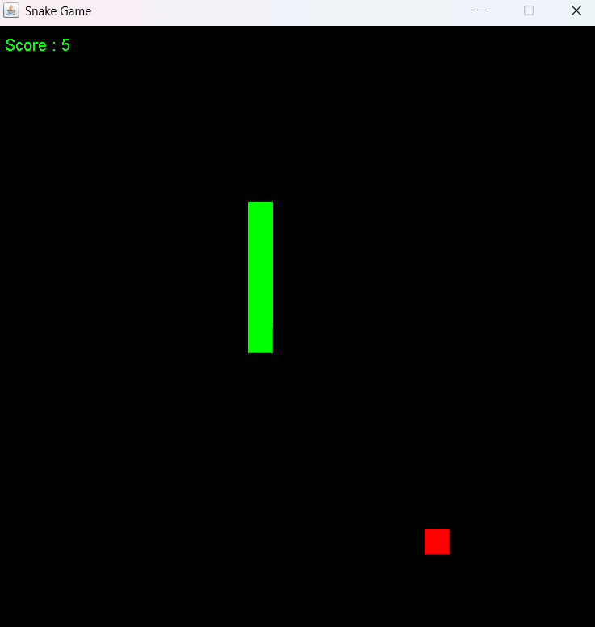

# 🟢 Snake Java Clone

[](https://www.java.com/)
[]()
[](https://opensource.org/licenses/MIT)

Classic Snake game built in Java using Swing. Navigate the snake across a tile-based grid, collect food, and grow longer while avoiding collisions.

---

# 🎮 Features

- Smooth snake movement and arrow key input  
- Self-collision and wall detection logic  
- Food spawns randomly across the board  
- Score tracking system  
- Grid-based board using tiles (24 x 24, 25px each)  
- Custom tile graphics support  

---

# 🧰 Getting Started

### 1. Clone the Repository

```bash
git clone https://github.com/yourusername/snakegame.git
cd snakegame
```
--------------------------------------------------------------------------------


